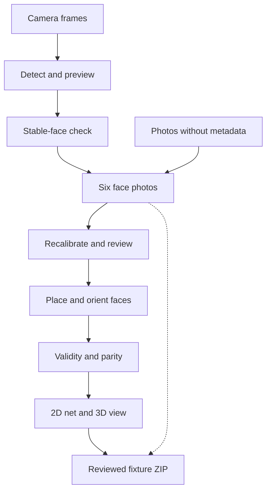

# Architecture

CubeAssembler is a static [Preact](https://preactjs.com) app built with
[Vite](https://vite.dev). It scans and assembles cubes entirely in the browser;
the optional localhost fixture upload server is for development. Unit tests
use Vitest, and browser tests use Playwright.

## Capture data flow

The dotted path carries the original photos into a fixture alongside the
reviewed colors; it does not bypass review.

The 3D viewer uses a transparent WebGL canvas; `web/style.css` supplies its
dark gray gradient and soft shadow behind the cube.

1. [`index.tsx`](../src/client/index.tsx) owns the camera, capture, review,
   and cube net UI. A raw video frame goes to
   [`liveAnalysis.worker.ts`](../src/client/liveAnalysis.worker.ts), keeping
   live analysis off the main thread.
2. [`gridAlignment.ts`](../src/client/gridAlignment.ts) locates and straightens
   the sticker grid. [`imageProcessing.ts`](../src/client/imageProcessing.ts)
   samples colors, checks face visibility, and recalibrates across six faces.
   [`autoCapture.ts`](../src/client/autoCapture.ts) tracks stable readings.
3. [`cubeAssembly.ts`](../src/client/cubeAssembly.ts) searches face identities
   and rotations. Odd cubes use fixed center colors; even cubes search identity
   and rotation together. Guided capture narrows the candidate arrangements
   to 64. [`orientationWizard.ts`](../src/client/orientationWizard.ts) asks about
   ambiguous placements, then [`parity.ts`](../src/client/parity.ts) checks
   physical validity.
4. [`fixtureZip.ts`](../src/client/fixtureZip.ts) exports reviewed photos and
   metadata. [`fixtureFormat.ts`](../src/client/fixtureFormat.ts) reads saved
   fixtures. The [fixture metadata schema](../public/schemas/fixture-meta-v1.schema.json)
   is published with the site. [`scripts/fixtureUploadServer.mjs`](../scripts/fixtureUploadServer.mjs)
   accepts uploads on localhost, from the dev server or (through CORS) the
   published app, and serves no files.

## Profiles and storage

[`profileSettings.ts`](../src/client/profileSettings.ts) separates cube size
and sticker gap from colors. [`profileStorage.ts`](../src/client/profileStorage.ts)
imports, exports, and stores custom definitions under
`cube-assembler-profiles-v1`. The eight built-in palettes come from
[`cube-assembler-profiles.json`](../cube-assembler-profiles.json).
[`colorProfileLearning.ts`](../src/client/colorProfileLearning.ts) guards
manual profile updates. [`preferences.ts`](../src/client/preferences.ts) keeps
the selected cube size and color profile ID, Mirror, Auto capture, sound, and
2D/3D display options in first-party cookies. See
[Cubes and color profiles](color-profiles.md).

## Tests and fixtures

`test/` contains unit and real-image regressions, while `e2e/` exercises the
browser flows. Reviewed capture photos and metadata live in `test/fixtures/`
and use Git LFS. Start with the [fixture guide](../test/fixtures/README.md)
before adding one. The Orbit64 browser codec is adapted from
`flix-orbit64` under [Apache-2.0](../third_party/flix-orbit64.LICENSE), with
cross-project vectors in `test/orbit64Vectors.json` and
`test/orbit64LargeVectors.json`.
