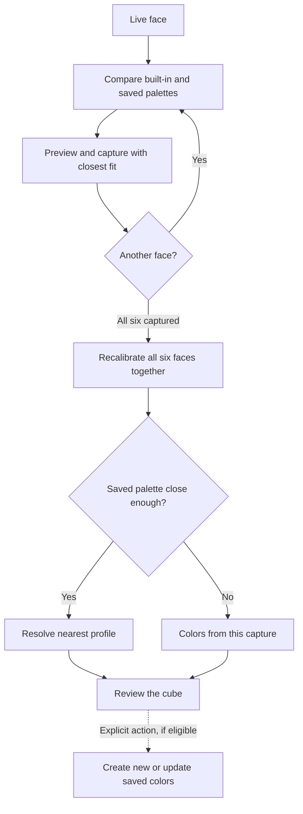

# Cubes and color profiles

**Cube** and **Colors** are separate settings. A cube records its name, size,
and sticker gap. A color profile records six sticker colors and can be reused
across sizes. The Generic cube offers each size from 2×2 to 7×7 with a 60%
sticker core and a 40% total gap. **New cube** copies the selected size and gap
so you can name and adjust a variant. Built-in cubes are read-only.

The eight built-in palettes come from [`cube-assembler-profiles.json`](../cube-assembler-profiles.json):
Classic, Matte, Acryl, and Plastic 1–5. They are always available and never
learn from captures. **New colors** copies a palette to a named, editable
profile. On the Profiles page, **Export cubes & colors** downloads both kinds
of profile; **Import cubes & colors** merges them by ID.

## Automatic colors

Automatic compares the live face with built-in and saved color profiles and
uses the closest fit for its preview. It rechecks after each captured face.
After all six faces, the app recalibrates their colors together and reports
the nearest profile if one fits; otherwise it says **Colors from this capture**.
The color fit measures palette similarity, not the probability that a physical
cube belongs to a particular brand. A manual color choice stays selected.

Automatic never edits a profile. After a valid, confident review, **Create
sticker color profile** saves the learned six-face palette under a new name.
**Update NAME profile** explicitly blends a capture into the matched saved
profile; the first captures count fully and later captures still contribute.
Learning requires at least 80% confident cells, at most 2% hand corrections,
mean OKLab palette distance no more than 0.08, and each color within 0.14.
These limits protect a profile from a weak or unrelated capture. Similar
palettes can still belong to different cubes.

## Compare and store profiles

The Colors tab compares profiles with A/B swatches. Its default merge limit
is ΔE 3.0. Swatches call distances below 3 **same**, 3 to under 12
**slightly different**, and 12 or more **different**; these labels do not
change the merge limit. Adjust the slider before merging palettes that differ
more. The Cubes tab likewise reviews cube geometry profiles.

Custom profiles use the browser storage key `cube-assembler-profiles-v1`.
First-party cookies remember the chosen cube size and color profile ID, along
with Mirror, Auto capture, sound, and 2D/3D display preferences. Profile
colors and custom cube settings stay in browser storage. If a saved profile
is missing, the selection falls back safely. Export JSON before clearing
browser data or moving devices.
