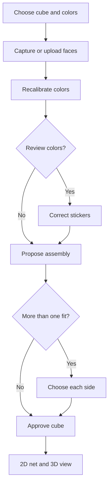

# User guide

[Open CubeAssembler](https://wstein.github.io/cube-assembler/). Scanning, review,
assembly, and ZIP import/export run in the browser. Choose a cube size from 2×2
through 7×7 before taking photos.

## Scan a cube

1. Choose a **Cube** (which sets its size) and **Colors**. Automatic compares
   built-in and saved color profiles as faces arrive; you can also select one.
2. Open the camera and show one face near the dashed guide. **Detect face**
   finds and straightens it. If that fails, choose **Guide grid** to read the
   fixed square on screen. Neither mode downloads a model.
3. Capture four sides while turning the cube, then its top and bottom. Auto
   capture waits for five matching good readings. A matching earlier pattern
   warns you but does not prevent capture: even cubes can have identical faces.
4. Review the six faces. The app recalibrates colors across all six photos.
   **Edit colors** lets you compare each detected face with its photo and fix a
   sticker. If the assembled state is valid and every reading is confident,
   the app can take you straight to assembly approval.
5. Approve the proposed cube. If several arrangements fit, **Choose each
   side** asks which face belongs where. The unfolded net shows U above the
   L–F–R–B row and D below it; the 3D viewer shows the same state.

The first two adjacent odd-cube faces keep their photographed slots. If the
second is opposite the first, it goes to slot 3 while slot 2 waits for an
adjacent face. Later odd-cube faces can be placed by their fixed center colors
even when photographed out of order. Even cubes have no fixed center, so they
stay in capture order. The net always shows captured colors, even with Mirror
enabled. Changing size after a capture asks before clearing saved faces.

### Remembered choices

First-party cookies remember the selected cube size and color profile,
Mirror, Auto capture, capture sound, and the **2D Net / 3D View** choice.
Within 3D View, **Stickerless / Stickered** and **Auto-rotate / Pause** are
remembered too. The gesture hint hides 10 seconds after the first touch and
returns after 20 seconds without touch. It turns off after 30 minutes of active
play; **Show 3D help** in Settings can turn it back on. Whole-cube x/y/z
gestures also count as touching the cube. Swipe a sticker in the 3D view to turn its row or column,
including inner slices on larger cubes. The layer follows your finger: let
go early and it springs back, keep dragging for two or three quarter turns,
or drag back to turn the other way. A quick flick finishes one turn, and a
turn that reverses the previous one removes it from the move list. Hold Shift
while swiping to turn a standard wide move such as Rw or 3Rw. With Turn sound
on, a tone marks the wide turn.
**Wide turns near gaps** is off by default. The gaps themselves do not start
turns; if a press starts in a gap, drag into a sticker to begin a swipe. Enable
the setting to select wide blocks by starting on a sticker near a gap (within
the outer quarter of the sticker) and leaning toward the side to include:
both layers at the line and every layer on that side turn. For example, on a
5×5, start beside the line between the third and fourth U rows and swipe
left, leaning up for 4Uw or down for 3Dw'. The chosen block lights up and
follows your lean
while your finger stays on the face it started on, so you can still switch
sides; once it leaves that face, the side is fixed. A swipe
straight beside the line still turns a wide block; reversing the turn direction
does not change which side is selected. A swipe from the middle of a sticker
turns one layer. A new swipe while the last turn settles finishes that turn
and starts the next.
With a mouse, drag the background to
rotate the view; it keeps turning briefly after release. On a touch screen,
one finger turns a layer, or a wide block beside a line between layers when
enabled.
Two fingers on the cube turn the whole cube, recorded as x, y or z, and two
fingers beside it rotate the view without recording anything; pinch to zoom.
A touchpad works the same way: a two-finger swipe over the cube turns it
(the touchpad's coasting after your fingers lift adds nothing),
one beside it rotates the view, and a pinch zooms, while a mouse
wheel still zooms. The X, Y and Z arrows in the corner show how the cube is
held: they point through R, U and F and take those faces' colors. On odd cubes,
middle-slice turns move the fixed centers and update the gizmo like a whole-cube
turn on the same axis. Turns snap into place like a magnetic cube: while you drag a layer or the whole cube, each quarter turn holds it like a magnet until you pull it free, and when you let go it is sucked onto the nearest quarter turn, snapping a little past it and settling back. They click
softly when capture **Sound** is on. Layer turns update the 2D net,
facelet notation, and Orbit64 token. The move list records completed turns;
**Undo** reverses the last one, and **Reset** returns to the captured state.
**Scramble** uses more moves for larger cubes and turns inner layers on 4×4–7×7,
while leaving the fixed middle layer alone on odd cubes.
The face buttons show one side head-on; **Isometric** and **Iso-back** show
the cube from its front corner or the opposite back corner. With the view
focused, the arrow keys tilt and turn it.
Auto-rotate pauses during a drag, a view button, or an arrow key and
resumes about 1.5 seconds later. These interactions do not change the saved
setting. Captured photos and cube states are not stored in cookies.

## Use photos or a saved fixture

**Upload files** accepts six cropped face images or full camera photos, with or
without `meta.json`, either selected together or packed in a ZIP. Without
metadata, it shows an order and framing preview: rearrange the faces and choose
Auto, Cropped face, or Full photo for each image. Files named `face-u.jpg`
through `face-b.jpg` start in capture-slot order. With metadata, it loads the
saved colors as a fixture. The chosen cube size applies to ordinary photos.
Full photos use the selected **Detect face** or **Guide grid** mode; cropped
face images are read directly. In Guide grid mode, select **Cropped face** for
an image that is already cropped but does not use a `face-*.jpg` filename.

After confirming a cube, **Save as test fixture** downloads its six photos and
reviewed colors as a ZIP. With `npm run fixture:server` running on the same
computer, **Upload to localhost** saves it straight into `test/fixtures/`, from
the dev server or the published app. See the [fixture guide](../test/fixtures/README.md).

## Enter or copy facelets

**Type colors** and the notation output panel share a format switch:

- **WRG facelets:** six space-separated blocks of N² color letters (W/O/G/R/B/Y)
  in U R F D L B order. A solved 3×3 starts `WWWWWWWWW RRRRRRRRR`.
- **URF facelets:** the same structure using U/R/F/D/L/B for the face whose
  solved color each sticker matches. A solved 3×3 starts
  `UUUUUUUUU RRRRRRRRR`.

Pasting text usually selects the matching format. Inputs containing only R and
B are ambiguous, so the existing switch is kept. The notation panel can also
copy an [Orbit64.Net](https://github.com/wstein/flix-orbit64/blob/main/FORMAT.md#spaced-facelet-reference-vectors)
compact state token for 2×2–7×7. Paste facelets or a state token into **Type
colors**; move and algorithm tokens are separate formats and are not accepted.
